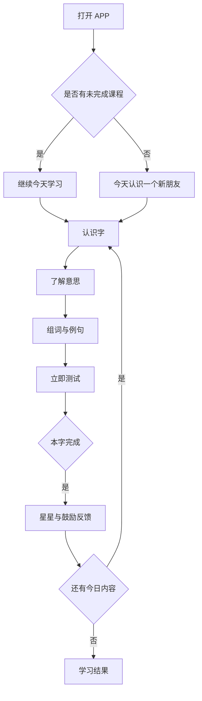
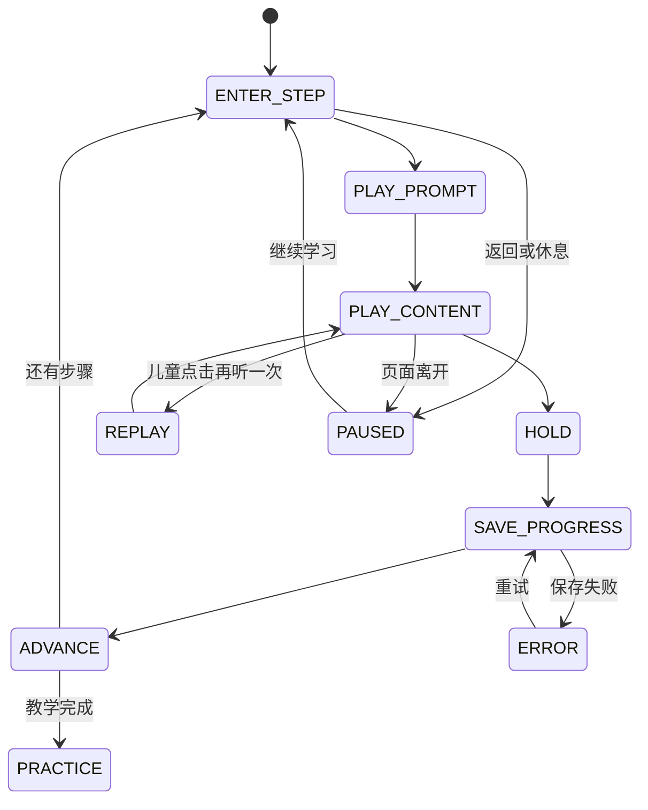

# 识字 APP V2.0 页面流程

## 1. 总流程



## 2. 四个入口

```text
学习 ──> 今日学习会话 ──> Learn ──> Practice ──> Result
挑战 ──> 老朋友复习 / 阶段挑战 ──> Practice ──> Result
字卡 ──> 五列图鉴 ──> 单击播放 / 长按详情
我的星球 ──> 成长首页 ──> 头像、徽章、装饰预览
```

## 3. 学习状态机



## 4. 状态约束

- 音频失败时停留在当前步骤，不自动跳过。
- 自动推进前先保存进度，保存失败不发奖励。
- 重听不会重复保存步骤或重复领取奖励。
- 快速点击不能产生重复播放、重复提交或重复奖励。
- 时间限制只在当前步骤/题目完成后生效。
- 退出后按会话状态恢复，不要求儿童重新开始。

## 5. 题型流程

### 听音选字

进入题目自动播放字音，儿童点击一个汉字后立即判断。

### 看字选图

展示大字和图片选项，儿童点击一张图片后立即判断。

### 找相同字

展示目标字和文字选项，儿童点击相同汉字后立即判断。

## 6. 反馈流程

```text
答对 → 温和鼓励 → 星星动画 → 约 800ms 后下一题
第一次答错 → “不着急，再看一眼” → 重播提示 → 再选一次
第二次答错 → 突出正确答案 → 播放字音 → 教学停留 → 下一题
```
